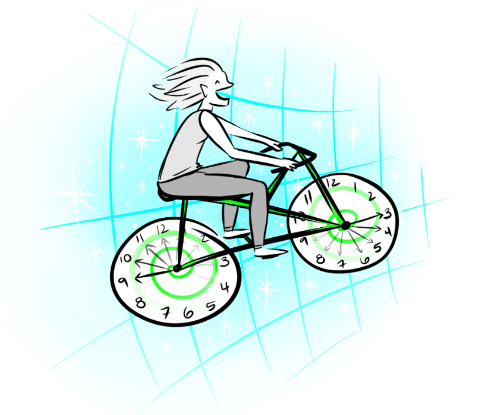

# Why Heracliteans Cannot Travel to the Past
 
*Tabitha Frahm - PHI 330 Metaphysics - April 15, 2010*

Concerning the no-past destination objection to time travel in regards
to the Heraclitean conception of time, William Grey argues that the past
is unchangeable and subsequently time travel is impossible. Phil Dowe
replies that although the past cannot be changed, it can be causally
affected; therefore, time travel is possible. I will argue that the
problem with time travel to the past on a Heraclitean conception occurs
because of ‘relative future determinism.’

In his paper “Troubles with Time Travel,” Grey asserts that time travel
to the past requires that the past be changeable. However, assuming a
Heraclitean conception of time, “\[t\]he past… is ordinarily taken to be
fixed and determined and not subject to change” (Grey, 57). Therefore,
as it is impossible to change the past, time travel to the past must be
impossible.

Dowe replies to this objection in his paper “The Case for Time Travel.”
He states that Grey’s no-past-destination objection to time travel
applies equally to the Parmenidean conception of time. He finds it odd
that Grey would restrict this objection to the Heraclitean view. While
the Heraclitean view holds the past to be fixed, the same is true on the
Parmenidean conception, which holds future truths as fixed as well.
Assuming Grey’s objection to be correct, it would apply to both the past
and future.

Dowe also says that Grey’s objection is “based on a confusion between
causing and changing past events” (Dowe, 444). Per Dowe, past events
cannot be *changed*, but they can be *caused*. So, the
no-past-destinations objection applies neither to the Heraclitean nor
the Parmenidean conception of time.

Travel to past does not require changeability of past. Just because the
past is fixed does not mean that a time traveler cannot affect the past.
Dowe consents that the past cannot be changed, as changing the past
would bring about a contradiction; something would happen and not
happen. “If a man lived through 1950, then one cannot go back to that
year and kill that man.” But, he says, the past can be affected. “If it
is true that a man died in 1950, then a time traveler can travel back
and kill that man that year” (Dowe, 444).

                  **Traveler Time**   **Year**   **Observer Time**   
  --------------- ------------------- ---------- ------------------- -------------
  **Past**        **Time A**          **1950**   **Time A**          **Past 1**
  **Present 1**   **Time B**          **2010**   **Time C**          **Present**
  **Present 2**   **Time C**          **1950**   **Time A**          **Past 1**
  **Future**      **Time D**          **1955**   **Time B**          **Past 2**

*Table 1: Traveler Time vs. Observer Time*

While Grey and Dowe make interesting assertions about time travel to the
past, I contend that the real problem lies in the relative future of a
time traveler arriving in the past (See Table 1). On a Heraclitean
conception of time, once a time traveler arrives in the past, the past
(Traveler Time B) will then become his present, and the relative future
(Traveler Time C) for that traveler will already have occurred in the
past on his personal timeline. Therefore, the traveler’s relative future
would be determined in such a way that the ‘future’ is no longer
“genuinely open” as required by the Heraclitean conception of time (Grey,
57). I call this concept ‘relative future determinism.’

I have no quarrel with the notion that past events can be caused but
cannot be changed, and that this claim allows for time travel to the
past. However, because of ‘relative future determinism,’ there remains
an inconsistency. For this reason, I conclude that time travel to the
past is not possible for Heracliteans based on their conception of time.

 

**References:**

Dowe, P. (2000). The Case for Time Travel. *Philosophy,* *75*(293),
441-451. Retrieved from <http://www.jstor.org/stable/3751943>

Grey, W. (1999). Troubles with Time Travel. *Philosophy,* *74*(287),
55-70. Retrieved from <http://www.jstor.org/stable/3752093>
